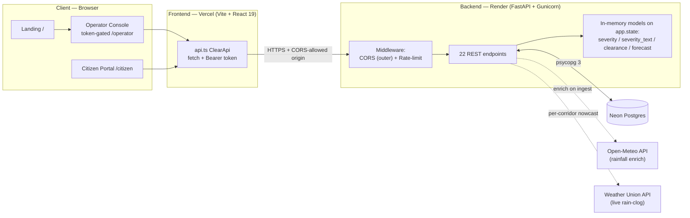
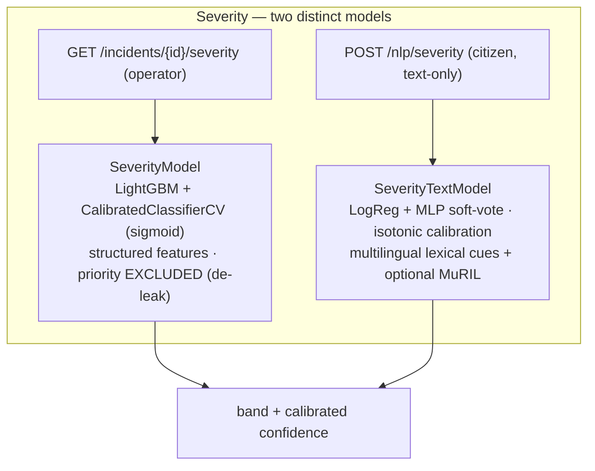
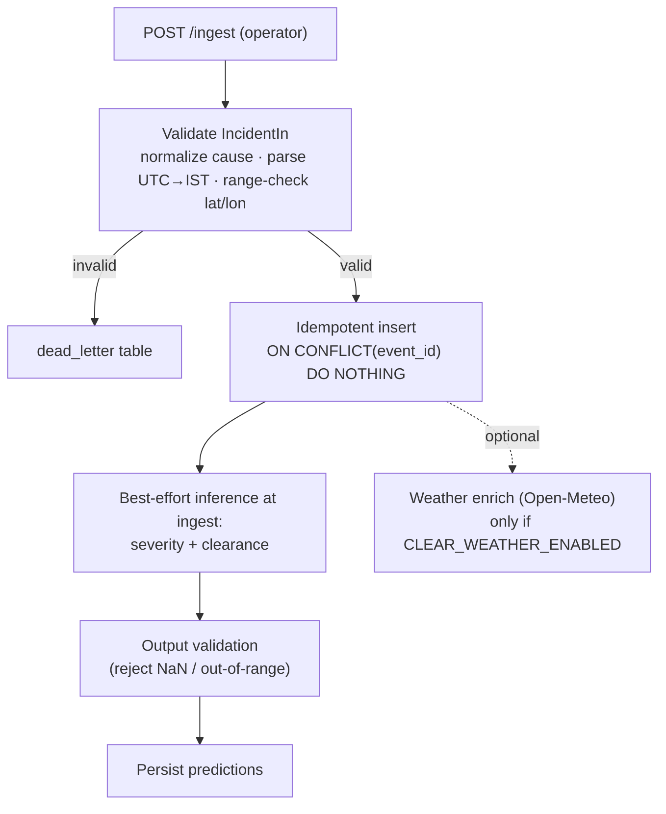
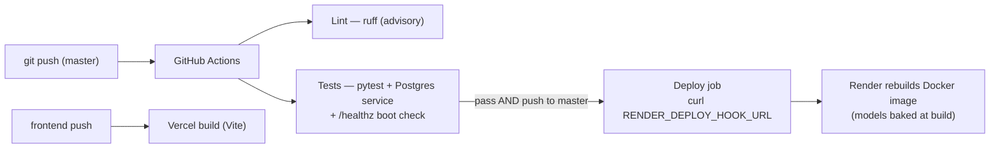
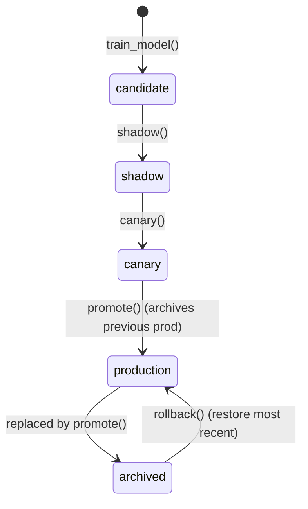

# SPANDANA — Clearance & Logistics Engine for Authority Response

> **SPANDANA** turns raw Bengaluru traffic-incident reports into ranked, confidence-aware recommendations — *how severe* an incident is, *how long* it will take to clear, *where* risk is rising in the next 3 hours, *which* units to dispatch, and *what* diversions and rain-clog risks to expect.
>
> **SPANDANA advises. A human operator always confirms.** It never controls traffic signals and is **not** the live BTP “ASTraM” product.

<sub>The public product is branded **SPANDANA**; the internal Python package and run commands are still named `clear` (e.g. `clear.app:app`).</sub>

---

## Table of contents

1. [In plain English](#1-in-plain-english)
2. [What SPANDANA is (and is not)](#2-what-spandana-is-and-is-not)
3. [System architecture](#3-system-architecture)
4. [Tech stack](#4-tech-stack)
5. [Repository structure](#5-repository-structure)
6. [Data model](#6-data-model)
7. [Models & analytics](#7-models--analytics)
8. [Request & inference lifecycle](#8-request--inference-lifecycle)
9. [API reference (22 endpoints)](#9-api-reference-22-endpoints)
10. [Cross-cutting backend behavior](#10-cross-cutting-backend-behavior)
11. [Optional / flag-gated features](#11-optional--flag-gated-features)
12. [Frontend](#12-frontend)
13. [Configuration & environment variables](#13-configuration--environment-variables)
14. [Local development](#14-local-development)
15. [Deployment & CI/CD](#15-deployment--cicd)
16. [Testing](#16-testing)
17. [Retrain lifecycle](#17-retrain-lifecycle)
18. [Known limitations & demo notes](#18-known-limitations--demo-notes)
19. [Team](#19-team)

---

<video src="https://github.com/user-attachments/assets/45c44456-7aab-4d9e-ab41-3c88f5c75ffc" autoplay loop muted width="100%" style="max-width: 100%;">
</video>

---
## 1. In plain English

Imagine a traffic control room in Bengaluru. Reports pour in: a breakdown on Hosur Road, a tree fall near MG Road, water-logging on Sarjapur Road. Operators have to decide — instantly — *which incident matters most, how long it will tie up the road, and which patrol to send.* Today that’s done from memory and gut feel.

SPANDANA is the **decision-support layer** that sits beside the operator and answers those questions with data:

| The operator asks… | SPANDANA answers with… |
| --- | --- |
| “How bad is this one?” | A **severity band** (low → critical) with an honest **confidence %**. |
| “How long until the road clears?” | A **time range** (e.g. “~52 min, likely 28–95 min”), never a fake exact number. |
| “Where will trouble flare up next?” | A **3-hour risk score** for each corridor. |
| “Who should I send?” | A **ranked dispatch plan** the operator must approve before anything happens. |
| “Will rain make it worse?” | A **live rain-clog risk** score per corridor. |

The golden rule: **SPANDANA only suggests — the operator decides.** Nothing is ever actuated automatically. And every number is “honest”: confidence is calibrated, time estimates are ranges, and if a model is missing the system *degrades gracefully* (shows last-known data) instead of crashing.

---

## 2. What SPANDANA is (and is not)

SPANDANA is a full-stack project (Team **FlipKart-GridLock**, Thapar Institute) that ingests traffic-incident data and serves analytics + ML predictions through a role-scoped REST API and a React dashboard.

**Design philosophy (baked into the code as numbered engineering constraints):**

- **Decision-support, never autonomous.** Every dispatch recommendation carries `requires_confirmation: true` and `autonomous_actuation: false`. The service never actuates signals.
- **Graceful degradation over crashing.** A missing or broken model degrades a single route (stale data, FIFO queue, or `503`) instead of taking the whole API down.
- **Honest outputs.** Confidence is *calibrated*; clearance is a *censored-survival interval* (P10–P90), not a fake point ETA; SLA is computed only over incidents that physically resolved.
- **Env-driven secrets.** Every token/key comes from environment variables only — nothing hard-coded.

> ⚠️ **Not ASTraM.** The codebase explicitly disclaims being the live Bengaluru Traffic Police product. It is a decision-support layer built on Bengaluru's data.

---

## 3. System architecture

Two independently deployed halves talk over HTTPS:

- **Backend** → Docker image on **Render** (`https://flipkart-gridlock.onrender.com`). ML models are **baked into the image at build time**, so the container boots ready to serve.
- **Frontend** → **Vercel** (`https://flip-kart-grid-lock.vercel.app`). Vite inlines `VITE_*` env vars at build time.
- **Database** → **Neon Postgres** (pooled serverless connection).



---

## 4. Tech stack

| Layer | Technologies |
| --- | --- |
| Backend API | Python 3.11, FastAPI, Uvicorn workers under Gunicorn, Pydantic v2 / pydantic-settings |
| ML / analytics | scikit-learn, LightGBM, lifelines (survival analysis), OR-Tools (assignment), NumPy, pandas, joblib |
| Optional NLP | MuRIL (transformers + torch) — **local-only** extra, never in the production image |
| Database | Neon Postgres via psycopg 3 (batched bulk inserts) |
| Frontend | React 19, TypeScript, Vite, Tailwind CSS v4, TanStack Query v5, React Router 7, MapLibre GL, lucide-react |
| Infra / CI | Docker, Render (blueprint + deploy hook), Vercel, GitHub Actions (lint + pytest + boot check + deploy) |

---

## 5. Repository structure

```
FlipKart-GridLock/
├─ README.md                      # this file
├─ render.yaml                    # Render blueprint (Docker web service)
├─ .github/workflows/            # ci-cd.yml, monitor.yml
├─ backend/
│  ├─ Dockerfile                 # py3.11-slim; bakes models at build
│  ├─ entrypoint.sh              # bootstrap → gunicorn
│  ├─ gunicorn.conf.py           # uvicorn workers, bind $PORT
│  ├─ pyproject.toml requirements.txt .env.example RUNBOOK.md
│  ├─ data/raw/ data/seed/       # seed CSV + muril_cache.joblib
│  ├─ tests/                     # pytest suite + conftest.py
│  └─ src/clear/
│     ├─ app.py                  # FastAPI app + all 22 routes
│     ├─ config.py               # Settings (env-driven, CLEAR_* prefix)
│     ├─ auth.py  ratelimit.py   # bearer scopes + fixed-window limiter
│     ├─ db.py  schema.py        # Postgres I/O + 46-column contract
│     ├─ preprocessing.py        # normalize, UTC→IST, censoring, OSM snap
│     ├─ ingestion.py datagen.py
│     ├─ validation.py degradation.py metrics.py monitor.py
│     ├─ weather.py weather_union.py rain_clog.py backfill_weather.py
│     ├─ event_intel.py resource_planner.py diversion.py
│     ├─ nlp_corpus.py nlp_phrasebank.py nlp_muril.py precompute_muril.py
│     ├─ train.py retrain.py bootstrap.py smoketest.py telegram_bot.py
│     └─ models/
│        ├─ severity.py severity_text.py clearance.py
│        └─ forecast.py hotspot.py dispatch.py
└─ frontend/
   ├─ index.html vite.config.ts vercel.json package.json
   └─ src/
      ├─ App.tsx main.tsx api.ts types.ts auth.ts
      ├─ pages/   LandingPage, OperatorLogin, OperatorDashboard,
      │           OperatorStats, OperatorPlanning, CitizenView
      └─ components/ HealthBadge, IncidentQueue, IncidentDetails, MapLayer,
                     DispatchPanel, SlaWidget, MetricsWidget, RainRiskWidget,
                     RouteRainCheck, DiversionAid, CitizenReportForm,
                     RoadNetworkBackground
```

---

## 6. Data model

### 6.1 Raw incident contract (46 columns)

`schema.py` defines a fixed **46-column** Bengaluru incident schema (`RAW_COLUMNS`) that both the synthetic generator emits and ingestion accepts. (It deliberately includes a capitalized `Pot_holes` to exercise column normalization.)

- **Canonical event causes:** `breakdown`, `accident`, `tree_fall`, `water_logging`, `pot_holes`, `public_event`, `others`. Real-world variants (`vehicle_breakdown`, `procession`, `vip_movement`, `construction`, `fog`, …) are mapped onto these via **alias + keyword matching**, so the *same* pipeline ingests synthetic and real exports.
- **Priorities / severity bands:** `low`, `medium`, `high`, `critical`.
- **Validation (`IncidentIn`):** only `event_id`, `start_datetime`, `latitude`, `longitude` are truly required; present-but-null fields fall back to declared defaults; datetimes are parsed leniently (Postgres `timestamptz` text and literal `NULL` handled); lat/lon are range-checked.

### 6.2 Postgres tables (`db.py`)

| Table | Purpose |
| --- | --- |
| `incidents` | Canonical incident store (idempotent on `event_id`); carries derived `duration_minutes`, `event_observed`, `admin_close`, `junction_node`, IST timestamps. |
| `dead_letter` | Rows that failed validation or exhausted retries — **nothing is silently dropped**. |
| `predictions` | Logged model outputs (severity / clearance) with model version. |
| `recommendations` | Dispatch suggestions + confirmation/approval audit trail. |
| `corridor_risk` | Last-known corridor risk (used for degraded / stale serving). |
| `model_registry` | Model versions + lifecycle stage (candidate → shadow → canary → production → archived). |
| `correctness_metrics` | Time-series of MAE / PSI drift metrics. |
| `junction_cache` | Snap-to-OSM-node cache. |

**Ingestion path (`ingestion.py`):** validate → idempotency (`ON CONFLICT (event_id) DO NOTHING`) → store, with bounded retries + exponential backoff and dead-lettering. Bulk CSV loads are vectorized and flushed in 1000-row `executemany` batches (one network round-trip per batch).

---

## 7. Models & analytics

Four estimators load once into `app.state` at startup; each loads independently and **degrades if missing**. Hotspot + dispatch are computed on demand (not persisted estimators).



### 7.1 Severity — structured (`models/severity.py`)
> **Plain English:** “Given the structured facts of this incident, how serious is it — and how sure are we?”
- **Algorithm:** LightGBM classifier wrapped in `CalibratedClassifierCV` (Platt/sigmoid) so the reported confidence is meaningful (sigmoid chosen because isotonic pinned confidence at 1.0).
- **Features:** road closure, has-vehicle, free-text cue count, rainfall, lanes blocked, lat/lon, cyclical hour & day-of-week, corridor frequency, event-cause one-hots. **`priority` is deliberately excluded** to avoid leaking the label.
- **Output:** `{ band, confidence }`.

### 7.2 Severity — text-only (`models/severity_text.py`)
> **Plain English:** “A citizen typed a sentence (in any language) — how serious does it sound?”
- **Why it exists:** the citizen `/nlp/severity` endpoint only sends free text; the structured model’s features would collapse to constant fills (train/serve skew). This model trains on **only text-derivable signal**, so *train == serve*.
- **Algorithm:** soft-voting `LogisticRegression` + `MLPClassifier`, **isotonic-calibrated**, with a linear fallback if calibration fails.
- **Features:** tiered multilingual lexical cue counts (EN / हिन्दी / ಕನ್ನಡ / romanized), event-cause one-hots, has-vehicle, and optional PCA-reduced **MuRIL** embeddings. **Embedding dropout** during training keeps it confident from lexical cues alone — the production case where torch is absent and embeddings are zero.

### 7.3 Clearance time (`models/clearance.py`)
> **Plain English:** “How long until this road is clear? Give a realistic range, not a fake exact minute.”
- **Algorithm:** **censored survival analysis** — lifelines `LogNormalAFTFitter`.
- **Labels:** clearance = `resolved` (fallback `closed`) − `start`; still-open incidents are **right-censored** at their current age; status-closed rows with no timestamp are dropped (informative-missing); durations over the 24h cap are dropped to avoid pinning predictions at the ceiling.
- **Output:** `{ median_minutes, p10_minutes, p90_minutes, interval_note }` — an honest P10–P90 interval.

### 7.4 Corridor risk nowcast (`models/forecast.py`)
> **Plain English:** “Which corridors are about to get busy in the next 3 hours?”
- **Algorithm:** LightGBM regressor on per-corridor hourly incident counts (lag-1/2/3, 3-hour rolling mean, hour, day-of-week, corridor frequency) with early stopping.
- **Strictly a 3-hour-ahead nowcast** (no long-horizon forecasting). Output is normalized to a `risk` 0–100 per corridor; `/corridors/risk` ranks corridors and filters non-rankable buckets (`non-corridor`, `unknown`, `none`).

### 7.5 Hotspots (`models/hotspot.py`)
> **Plain English:** “Where do incidents cluster on the map?”
- **Algorithm:** DBSCAN over incident coordinates using the **haversine** metric (ball-tree, `eps` in meters, configurable `min_samples`). Batch over stored incidents; supports `min_size` and `limit` server-side trimming. Returns clusters with centroid + top corridor.

### 7.6 Dispatch optimization (`models/dispatch.py`)
> **Plain English:** “Given these patrol units and active incidents, who should go where — and is it better than ‘nearest-first’?”
- **Algorithm:** joint selection + assignment — serve the highest-impact incidents, then minimize total travel time via **OR-Tools linear sum assignment** (deterministic greedy fallback if OR-Tools is unavailable).
- Compared apples-to-apples against a FIFO/nearest baseline → `improvement_pct` (provably ≥ 0). Unit positions are labeled *assumed/external*; output **requires operator confirmation**.

### 7.7 Output validation (`validation.py`)
Every model output is validated before any persist/serve: rejects NaN/inf, enforces band ∈ bands, confidence ∈ [0,1], clearance in (0, cap] with ordered P10 ≤ median ≤ P90, risk ∈ [0,100].

---

## 8. Request & inference lifecycle



---

## 9. API reference (22 endpoints)

**Auth:** `Authorization: Bearer <token>`. Two scopes are resolved in `auth.py` — `operator` and `citizen`. `401` = missing/invalid token, `403` = wrong scope. `/healthz` needs no token.

| Method | Path | Scope | Purpose |
| --- | --- | --- | --- |
| GET | `/healthz` | none | Status + per-model up/down flags (severity, severity_text, clearance, forecast). |
| POST | `/ingest` | operator | Validate + idempotently store one incident; runs best-effort inference. |
| GET | `/incidents` | operator, citizen | List recent incidents (`limit`). |
| GET | `/incidents/{id}/severity` | operator | Structured severity band + confidence. |
| GET | `/incidents/{id}/clearance` | operator | Clearance median + P10–P90. |
| GET | `/corridors/risk` | operator, citizen | 3h corridor-risk nowcast (degrades to last-known stale risk). |
| GET | `/hotspots` | operator | DBSCAN clusters (`min_size`, `limit`). |
| POST | `/dispatch/suggest` | operator | Ranked dispatch assignment vs FIFO baseline (or degraded FIFO queue). |
| POST | `/dispatch/confirm` | operator | Human-in-the-loop confirmation of a recommendation. |
| POST | `/nlp/severity` | citizen | Text-only multilingual severity. (curl/CLI today — not wired into the UI.) |
| POST | `/citizen/report` | citizen | Citizen incident report (free text sanitized server-side). |
| GET | `/sla` | operator, citizen | SLA% over the physically-resolved subset only. |
| GET | `/events/types` | operator, citizen | Known event types for the impact simulator. |
| POST | `/events/impact` | operator, citizen | Scale a baseline clearance/risk by an event multiplier. |
| POST | `/resources/plan` | operator | Heuristic staffing/equipment plan (officers, barricades, tow trucks). |
| GET | `/diversions` | operator, citizen | Nearest alternate corridors (haversine) with travel-time deltas. |
| GET | `/weather/rain-risk` | operator, citizen | Live rain-clog risk 0–100 + ETA multiplier (Weather Union). |
| GET | `/metrics/by-event` | operator | Clearance MAE grouped by event cause. |
| GET | `/metrics` | operator | Clearance error summary + recent metric history. |
| POST | `/metrics/backfill` | operator | Backfill predictions for resolved incidents so metrics aren’t empty. (CLI/curl.) |
| GET | `/admin/drift` | operator | Out-of-sample MAE + PSI drift report. (CLI/curl.) |
| POST | `/admin/retrain` | operator | Trigger the retrain lifecycle. (CLI/curl.) |

> 🔌 **Frontend ↔ backend contract:** `api.ts` exposes typed `ClearApi` methods. Three operator endpoints — `/metrics/backfill`, `/admin/drift`, `/admin/retrain` — are intentionally **not** wired into the client (operated via curl/CLI). The API base is `VITE_CLEAR_API_BASE` (falls back to `http://localhost:8000`); a failed fetch surfaces as `ApiError(0, …)` → the UI’s red “System Degraded” badge.
---

## 10. Cross-cutting backend behavior

- **Auth & scopes (`auth.py`):** bearer token → `operator` or `citizen`; a dependency factory enforces allowed scopes per route.
- **Rate limiting (`ratelimit.py`):** in-process fixed-window limiter (default **120 req / 60 s** per token-or-IP), returns `429` + `Retry-After`; `/healthz` exempt. Registered **before** CORS so 429s keep their CORS headers.
- **CORS (`app.py` + `config.py`):** allowed origins come from `CLEAR_CORS_ALLOW_ORIGINS` (comma-separated; default localhost only). **The deployed frontend origin must be added or the browser blocks every call.**
- **Graceful degradation (`degradation.py`):** forecast down → last-known *stale* corridor risk; dispatch down → deterministic priority-FIFO queue; any model down → `503` on that route while the rest stays up.
- **Prompt-injection guard (`app.py`):** free text is sanitized (control-char strip, length cap, injection-pattern redaction) before any downstream use.
- **Logging (`logging_setup.py`):** single stdout logger, no network handlers at import.

---

## 11. Optional / flag-gated features

All of these are **off by default** — with their flags off, the backend is byte-for-byte the core service.

| Feature | Module(s) | Notes |
| --- | --- | --- |
| Open-Meteo rainfall enrichment | `weather.py`, `backfill_weather.py` | Fills `rainfall_mm` on ingest / offline backfill. `CLEAR_WEATHER_ENABLED`; every failure path returns `0.0`. |
| Live rain-clog risk | `weather_union.py`, `rain_clog.py` | Blends live Weather Union rain (intensity + accumulation) with per-corridor historical water-logging propensity into a 0–100 score + 1.0–1.6 ETA multiplier. Needs `CLEAR_RAIN_CLOG_ENABLED` + API key. |
| Event impact simulator | `event_intel.py` | Tunable per-event-type congestion multipliers (no ML); scales a baseline clearance/risk. |
| Resource planner | `resource_planner.py` | Heuristic staffing: officers/attendees, barricades/closure, tow/attendees, scaled by event multiplier. |
| Diversions | `diversion.py` | Nearest alternate corridors by haversine distance from the configured corridor lat/long map (primary/secondary + delta minutes). |
| MuRIL multilingual embeddings | `nlp_muril.py`, `nlp_corpus.py`, `nlp_phrasebank.py`, `precompute_muril.py` | Local-only (torch). A sha1 embedding cache (`muril_cache.joblib`) is seeded so build-time training and serving get cache hits with **zero torch in prod**. |
| Telegram bot | `telegram_bot.py` | Optional standalone process; pure citizen-scope HTTP client. Disabled by default; never touches the web app. |

---

## 12. Frontend

### 12.1 Routes (`App.tsx`)

TanStack Query (`retry: false`, `refetchOnWindowFocus: false`) wraps a React Router app. A global `HealthBadge` polls `/healthz` every 30s.

| Route | Page | Access |
| --- | --- | --- |
| `/` | LandingPage | Public — hero (animated road-network background + traffic-signal title), problem/solution, team modal |
| `/operator/login` | OperatorLogin | Validates the access code by calling `/metrics`; token stored in `sessionStorage` |
| `/operator` | OperatorDashboard | Guarded — incident queue + map + analysis modal + dispatch |
| `/operator/stats` | OperatorStats | Guarded — SLA, metrics, corridor risk, hotspots, post-event accuracy |
| `/operator/planning` | OperatorPlanning | Guarded — event-impact simulator + resource planner |
| `/citizen` | CitizenView | Rendered only when `VITE_CLEAR_CITIZEN_TOKEN` is set |

### 12.2 Components → endpoints

| Component | Calls | Role |
| --- | --- | --- |
| HealthBadge | `/healthz` | Green “Operational” / amber “Models Degraded” / red “System Degraded” (red = fetch failed). |
| IncidentQueue | `/incidents` | Searchable, priority-filtered live queue. |
| IncidentDetails | `/incidents/{id}/severity`, `/clearance` (+ Diversion/Rain cards) | Per-incident intelligence; gates calls on `/healthz` model flags. |
| MapLayer | `/hotspots`, `/corridors/risk`, `/weather/rain-risk` | MapLibre map with hotspot markers + rain-clog overlay. |
| DispatchPanel | `/dispatch/suggest`, `/dispatch/confirm` | Suggestion → human confirm; shows degraded FIFO notice. |
| SlaWidget / MetricsWidget | `/sla`, `/metrics` | SLA% and clearance-error metrics. |
| RainRiskWidget / RouteRainCheck | `/weather/rain-risk` | Per-corridor rain-clog card; citizen route checker. |
| DiversionAid | `/diversions` | Alternate-corridor list with deltas. |
| CitizenReportForm | `/citizen/report` | Public incident reporting. |
| OperatorPlanning | `/events/types`, `/events/impact`, `/resources/plan`, `/corridors/risk` | Event simulator + resource planner. |
| OperatorStats | `/metrics/by-event`, `/hotspots`, `/corridors/risk`, `/sla` | Post-event accuracy + system stats. |

---

## 13. Configuration & environment variables

### 13.1 Backend (prefix `CLEAR_`, from `config.py` / `.env.example`)

| Variable | Default | Meaning |
| --- | --- | --- |
| `CLEAR_DATABASE_URL` | localhost | Neon **pooled** Postgres URL (must be set in prod). |
| `CLEAR_OPERATOR_TOKEN` / `CLEAR_CITIZEN_TOKEN` | dev tokens | Role bearer tokens (must match the frontend’s `VITE_*` tokens). |
| `CLEAR_CORS_ALLOW_ORIGINS` | localhost:5173,3000 | Comma-separated allowed browser origins — **add the Vercel URL in prod**. |
| `CLEAR_RATE_LIMIT_ENABLED` / `_REQUESTS` / `_WINDOW_SECONDS` | true / 120 / 60 | Fixed-window rate limit. |
| `CLEAR_SLA_THRESHOLD_MINUTES` | 60 | SLA threshold. |
| `CLEAR_FORECAST_HORIZON_HOURS` | 3 | Nowcast horizon. |
| `CLEAR_HOTSPOT_EPS_METERS` / `_MIN_SAMPLES` | 150 / 5 | DBSCAN params. |
| `CLEAR_MAX_CLEARANCE_MINUTES` | 1440 | Clearance cap (24h). |
| `CLEAR_DRIFT_PSI_THRESHOLD` | 0.2 | Drift alert threshold. |
| `WEB_CONCURRENCY` | 2 | Gunicorn worker count. |
| `CLEAR_WEATHER_ENABLED` | false | Open-Meteo rainfall enrichment. |
| `CLEAR_RAIN_CLOG_ENABLED` + `CLEAR_WEATHER_UNION_API_KEY` | off | Live rain-clog feature + key. |
| `CLEAR_USE_MURIL` | false | MuRIL embeddings (local only). |
| `CLEAR_TELEGRAM_ENABLED` + `CLEAR_TELEGRAM_BOT_TOKEN` | off | Optional Telegram bot. |

### 13.2 Frontend (Vite, inlined at build)

| Variable | Meaning |
| --- | --- |
| `VITE_CLEAR_API_BASE` | Backend base URL (the Render URL in prod). Falls back to `http://localhost:8000`. Single value, `https`, no trailing slash. |
| `VITE_CLEAR_OPERATOR_TOKEN` | Operator token (also stored per-session after login). |
| `VITE_CLEAR_CITIZEN_TOKEN` | Citizen token; also gates whether the `/citizen` route renders. |

---

## 14. Local development

**Backend**

```bash
python -m venv .venv && source .venv/bin/activate
cp .env.example .env
pip install -e .[dev]
python -m clear.datagen --out data/raw/incidents.csv --n 20000   # synthetic data
python -m clear.ingestion --csv data/raw/incidents.csv           # idempotent load
python -m clear.train all                                        # severity, severity_text, clearance, forecast
uvicorn clear.app:app --reload --port 8000                       # serve; /docs for Swagger
```

**Frontend**

```bash
cd frontend
npm install
# .env.local: VITE_CLEAR_API_BASE=http://localhost:8000 + dev tokens
npm run dev   # http://localhost:5173
```

**Smoke-test every endpoint against a running API**

```bash
python -m clear.smoketest https://flipkart-gridlock.onrender.com
```

---

## 15. Deployment & CI/CD



- **Docker (`backend/Dockerfile`):** python:3.11-slim + `libgomp1` (LightGBM); installs the package; copies seed CSV + MuRIL cache; **trains all models at build** (`CLEAR_SKIP_MODEL_REGISTRY=1`) and asserts the artifacts exist → the container boots instantly with no cold-start retrain.
- **Entrypoint:** `bootstrap.py` (init schema + seed-ingest-if-empty + train-if-no-models) → Gunicorn (uvicorn workers, bind `$PORT`).
- **Render blueprint (`render.yaml`):** Docker web service, `dockerContext: ./backend`, free plan, health check `/healthz`; env vars `CLEAR_DATABASE_URL` (secret), generated tokens, `WEB_CONCURRENCY`, rain-clog flag + key. **Add `CLEAR_CORS_ALLOW_ORIGINS` = your Vercel URL** in the dashboard.
- **Vercel (`vercel.json`):** SPA rewrite of all routes to `/index.html`. Set the **Production Branch to `master`** and the `VITE_*` env vars, then redeploy.
- **CI (`ci-cd.yml`):** concurrency-cancels superseded runs; lint advisory; pytest against a throwaway Postgres + a no-network `/healthz` boot assertion; deploy only on `master` push.

---

## 16. Testing

`backend/tests/` (run with `pytest -q`): `test_idempotency.py`, `test_output_validation.py`, `test_preprocessing.py`, `test_planning_modules.py`, `test_rain_clog.py`, `test_nlp_severity_text.py`, `test_telegram_bot.py`, plus `conftest.py` (blocks DB tests against non-local URLs). `smoketest.py` is a live end-to-end check of every endpoint.

---

## 17. Retrain lifecycle (`retrain.py`)



Stages live in `model_registry`; the live serving pointer is the unversioned `<model>.joblib` that promote/rollback re-point. `auto_cycle()` (clearance-only) is a **gated** time-split retrain: it only promotes a candidate if it beats production on a holdout by a configurable margin.

---

## 18. Known limitations & demo notes

- **Free-tier cold start:** Render’s free plan sleeps after ~15 min idle; the first request can take ~50s — longer than the frontend’s fetch timeout → a transient “System Degraded” until warm.
- **CORS / base URL:** the deployed frontend only works if the Vercel origin is in `CLEAR_CORS_ALLOW_ORIGINS` **and** `VITE_CLEAR_API_BASE` points at the Render URL (rebuild after changing).
- **Token parity:** the frontend `VITE_CLEAR_*_TOKEN` values must equal the backend tokens or calls return `401`.
- **Weak-label boundary:** clearance training drops durations over the 24h cap; low-sample event causes are flagged “low sample”.
- **Diversions** are straight-line (haversine) estimates, not routed travel times.
- Four admin/NLP endpoints have no UI yet (curl/CLI only).

---

## 19. Team

**Jaiveer Singh** · **Harkamal Singh** · **Aditya Kumar** · **Dhruv Srivastava**.
- Thapar Institute of Engineering and Technology.
